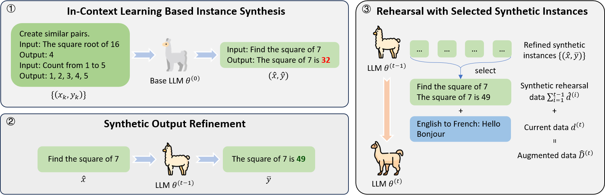

# Self-Synthesized Rehearsal (SSR)

🎉 Welcome to the repository for "Mitigating Catastrophic Forgetting in Large Language Models with Self-Synthesized Rehearsal" (ACL2024, [📃arXiv Paper](https://arxiv.org/abs/2403.01244)).



## Codebase Structure

This codebase is built on top of [LLaMA-Factory](https://github.com/hiyouga/LLaMA-Factory) framework.

To get started with SSR, please refer to the following directory tree structure of the codebase:

```shell
├── custom
│   ├── alpaca_eval
│   ├── icl_gen                     # Instance synthesis
│   └── niv2-c012                   # SuperNI data preprocessing
├── data                            # datasets
├── mmlu_test
├── saves
└── src
    ├── llmtuner
    └── scripts-ni-c012             # Examples of run scripts
```

## Installation

```bash
pip install -r requirements.txt
```

## Pipeline

### Step 1: In-Context Learning Based Instance Synthesis

1. use `custom/icl_gen/complete_param_nic010_cate.py` for generation 
2. use `custom/icl_gen/parser.py` for postproessing
3. use `custom/icl_gen/random_select.py` or `custom/icl_gen/kmeans_self.py` for instance selection (recommended for efficiency)
    * *for KMeans-based instance selection, use `custom/niv2-c012/text2emb.py` to get the embedding of instance inputs*

### Step 2: Synthetic Output Refinement

1. use `custom/icl_gen/label_param.py` (integrated in the following scripts)

### Step 3: Rehearsal with Selected Synthetic Instances

- **multi-task learning (MTL)**: `src/scripts-ni-c012/lora/all/[model_name]/[model_name].lora.[all|all_5].3ep.bs32x1x1.bf16.sh`
- **single task (& Stage 1 in continual learing)**: `src/scripts-ni-c012/lora/sing/[model_name]/[model_name].lora.single.3ep.bs32x1x1.bf16.sh`
- **Non-rehearsal**: `src/scripts-ni-c012/lora/[cl|cl2|cl3]/[model_name]/[model_name].lora.[cl_queue|cl_queue2|cl_queue3].3ep.bs32x1x1.lr2e-04.bf16.sh`
- **RandSel**: `src/scripts-ni-c012/lora/[cl|cl2|cl3]/[model_name]/[model_name].lora.[cl_queue|cl_queue2|cl_queue3]_rp.3ep.bs32x1x1.lr2e-04.bf16.sh`
- **KMeansSel**: `src/scripts-ni-c012/lora/[cl|cl2|cl3]/[model_name]/[model_name].lora.[cl_queue|cl_queue2|cl_queue3]_km20_rp.3ep.bs32x1x1.lr2e-04.bf16.sh`
- **SSR**: `src/scripts-ni-c012/lora/[cl|cl2|cl3]/[model_name]/[model_name].lora.[cl_queue|cl_queue2|cl_queue3]_iclgen_self.3ep.bs32x1x1.lr2e-04.bf16.sh`

**Note**: You should train the first task of contiunal learning using the `single task` script before executing `SSR`/`RandSel`/`KMeansSel`/`Non-rehearsal` scripts.

## Citation

If you find this useful in your research, please consider citing:

    @inproceedings{huang-etal-2024-mitigating,
        title = "Mitigating Catastrophic Forgetting in Large Language Models with Self-Synthesized Rehearsal",
        author = "Huang, Jianheng  and
          Cui, Leyang  and
          Wang, Ante  and
          Yang, Chengyi  and
          Liao, Xinting  and
          Song, Linfeng  and
          Yao, Junfeng  and
          Su, Jinsong",
        editor = "Ku, Lun-Wei  and
          Martins, Andre  and
          Srikumar, Vivek",
        booktitle = "Proceedings of the 62nd Annual Meeting of the Association for Computational Linguistics (Volume 1: Long Papers)",
        month = aug,
        year = "2024",
        address = "Bangkok, Thailand",
        publisher = "Association for Computational Linguistics",
        url = "https://aclanthology.org/2024.acl-long.77",
        pages = "1416--1428",
        abstract = "Large language models (LLMs) suffer from catastrophic forgetting during continual learning. Conventional rehearsal-based methods rely on previous training data to retain the model{'}s ability, which may not be feasible in real-world applications. When conducting continual learning based on a publicly-released LLM checkpoint, the availability of the original training data may be non-existent. To address this challenge, we propose a framework called Self-Synthesized Rehearsal (SSR) that uses the LLM to generate synthetic instances for rehearsal. Concretely, we first employ the base LLM for in-context learning to generate synthetic instances. Subsequently, we utilize the latest LLM to refine the instance outputs based on the synthetic inputs, preserving its acquired ability. Finally, we select diverse high-quality synthetic instances for rehearsal in future stages. Experimental results demonstrate that SSR achieves superior or comparable performance compared to conventional rehearsal-based approaches while being more data-efficient. Besides, SSR effectively preserves the generalization capabilities of LLMs in general domains.",
    }

or

    @misc{huang2024mitigating,
        title={Mitigating Catastrophic Forgetting in Large Language Models with Self-Synthesized Rehearsal}, 
        author={Jianheng Huang and Leyang Cui and Ante Wang and Chengyi Yang and Xinting Liao and Linfeng Song and Junfeng Yao and Jinsong Su},
        year={2024},
        eprint={2403.01244},
        archivePrefix={arXiv},
        primaryClass={cs.CL}
    }
